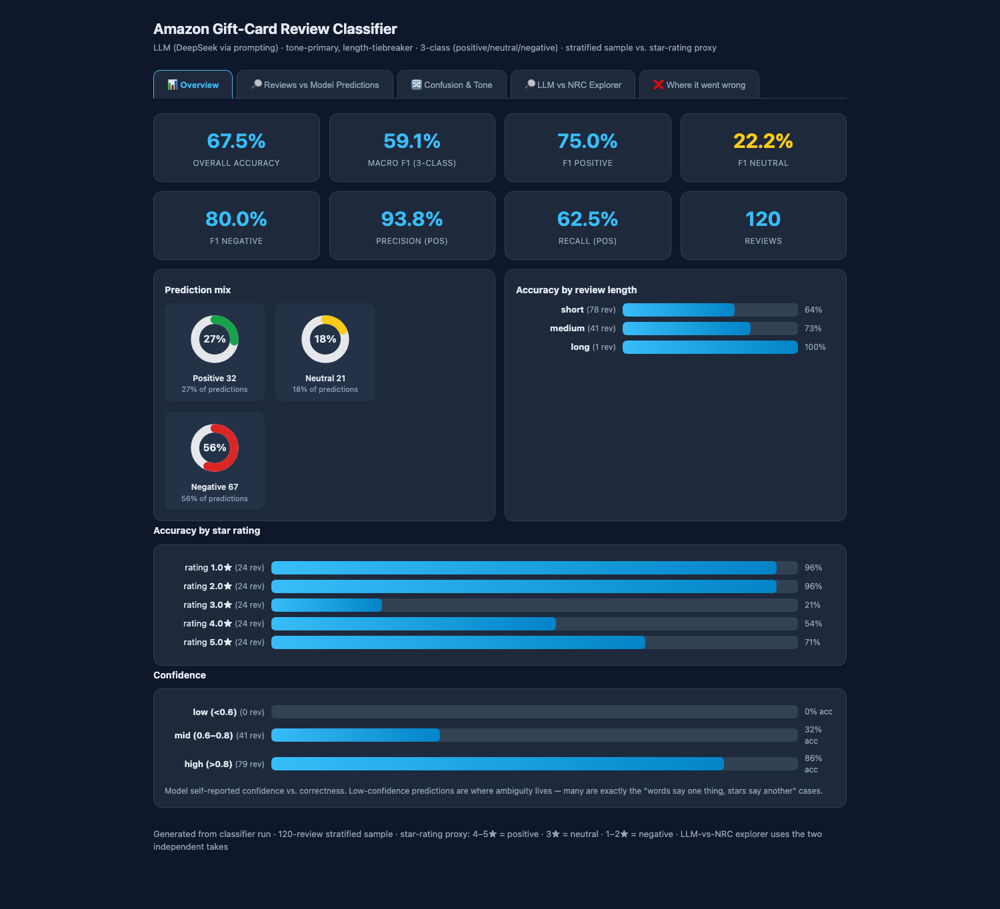
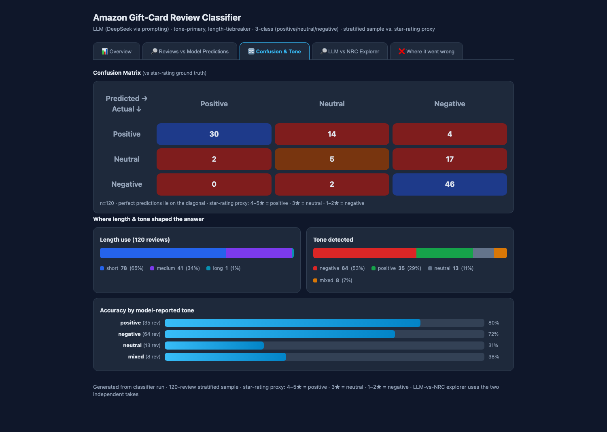
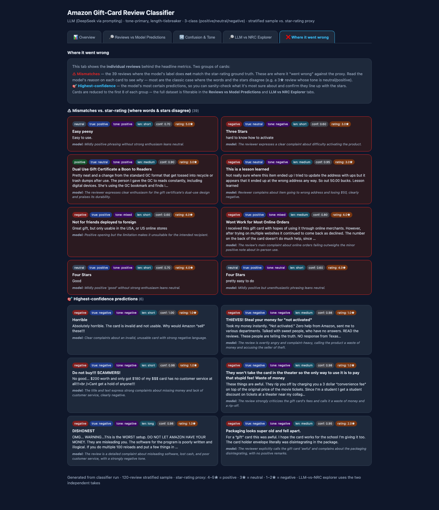
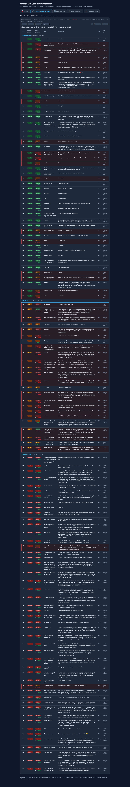
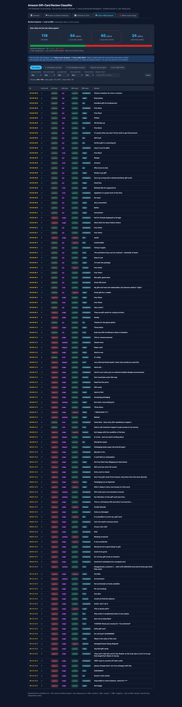

# LLM Review Classifier — Amazon Gift Cards · Analysis Report

This project builds an LLM-based sentiment classifier for Amazon **Gift Card**
product reviews and analyzes it. This README is written as a **report** that
answers four specific questions about the model, the data, the evaluation, and
the process.

> **Dataset note.** Raw/intermediate data is intentionally *not* committed to this
> repo. The dashboards are **self-contained** — each embeds its own review data — so
> they render as-is after cloning. The raw review dataset and the NRC emotion lexicon
> are large third-party files you download at runtime; the smaller intermediate JSON
> are regenerated by the scripts. Everything else (`*.py` scripts, the generated
> dashboards, and this report) is committed.
>
> Download them and unzip into `data/`:
> - **Reviews dataset:** McAuley Lab (UCSD) *Amazon Reviews 2023*, Gift_Cards category
>   → https://mcauleylab.ucsd.edu/public_datasets/data/amazon_2023/raw/review_categories/Gift_Cards.jsonl.gz
> - **NRC Emotion Lexicon (EmoLex v0.92, 14,182 words × 10 categories):**
>   → https://raw.githubusercontent.com/Franck-Dernoncourt/NRC_Emotion_Lexicon/master/NRC-emotion-lexicon-wordlevel-alphabetized-v0.92.txt
>   (save as `data/NRC-Emotion-Lexicon-Wordlevel-v0.92.txt`)
>
> Then `python nrc_scorer.py && python llm_emotion.py && python compare_takes.py` to
> rebuild the intermediate artifacts the scripts read.

---

## Quick answers

| Question | Short answer |
|---|---|
| **1. Lopsided run** | The category is ~88.5% positive, so a naive "always positive" model already scores ~88.5% — a run on the raw distribution is mostly measuring majority-class luck. Stratified sampling equalizes the classes so accuracy measures real discrimination. |
| **2. Error directions** | Mistakes run **positive → neutral** (14) and **neutral → negative** (17). The classifier is best at negative, worst at neutral. |
| **3. LLM emotions vs NRC** | They agree on the primary emotion only **24/119 (20%)**. The LLM reads the whole phrase and tracks rating (~92%); the word list over-weights neutral catalog words, so it reads most reviews as **anticipation** and leans positive. |
| **4. Bugs / issues** | Empty LLM responses (reasoning ate the token budget), jsdom timing pitfalls, Python f-string vs. JS `{}` collisions, donut-label overlap, and the star-vs-tone ground-truth mismatch. Details below. |

---

## Dashboard screenshots

The consolidated dashboard (`data/dashboard.html`) is a tabbed single-page view.
Screenshots of each tab are committed under `screenshots/`:

| Tab | Screenshot |
|---|---|
| 📊 **Overview** | `screenshots/dashboard_overview.png` |
| 🔀 **Confusion & Tone** | `screenshots/dashboard_confusion.png` |
| 🔎 **Reviews vs Model Predictions** | `screenshots/dashboard_descriptive.png` — a very tall table (120 reviews); shown here cropped |
| ❌ **Where it went wrong** | `screenshots/dashboard_errors.png` |
| 🔎 **LLM vs NRC Explorer** | `screenshots/dashboard_explorer.png` — a very tall table (119 reviews); shown here cropped |

You can open any tab directly (and screenshot it individually) with a URL param,
e.g. `data/dashboard.html?tab=overview`, `?tab=confusion`, `?tab=descriptive`,
`?tab=errors`, `?tab=explorer`.







The **Descriptive layer** (Reviews vs Model Predictions) tab shows the full
correct-answer-vs-prediction table grouped by class, with right/wrong filtering:



The **LLM vs NRC Explorer** tab shows both independent takes on every review
with full filters, sorting, and expandable rows:



---

## 1. Why the lopsided run looked very accurate — and what sampling changed

**The data is extremely one-sided.** Of the 152,410 Gift Card reviews:

| Ground-truth class | Count | Share |
|---|---|---|
| POSITIVE (4–5★) | 134,940 | **88.5%** |
| NEUTRAL (3★) | 3,271 | 2.1% |
| NEGATIVE (1–2★) | 14,199 | 9.3% |

This means a model that does **nothing but predict "positive"** for every review
would score **~88.5% accuracy** on the raw pool without understanding a single
word. If you run the classifier on naturally-sampled data (or evaluate on the
full distribution), the headline accuracy stays high mostly because *most reviews
are easy positives* — the metric is dominated by majority-class luck, and it
barely tests the model on the few negatives.

**Stratified sampling fixes the benchmark, not the model.** We draw a sample with
roughly equal counts from each class, which has three effects:

- The **baseline collapses.** Random-guessing among three balanced classes is 33.3%
  (vs. an 88.5% "always positive" majority baseline). The reported accuracy now
  reflects genuine signal, not class priors.
- The **hard classes get a seat at the table.** A 120-review stratified sample is
  ~48 positive / 24 neutral / 48 negative, so the model is actually *tested* on the
  tricky neutral and negative reviews it would otherwise rarely see.
- It is **comparable across experiments** — every run uses the same balanced draw
  (same `--seed`), so improvements are attributable to the model or prompt, not to a
  different mix of reviews.

Concrete effect on our numbers:

- **Binary run** (4–5★ positive, 1–3★ negative): 92.5% on a 120 stratified sample —
  but because the negative half there is a *strata-heavy* mix, that number is not
  directly comparable to "the real world's" 88.5%-positive pool.
- **3-class run** (positive/neutral/negative): **67.5% overall** on the same
  stratified 120 — very different from the ~88.5% you'd report on raw data, and
  much more honest about how often the model actually gets the class right once
  easy positives stop carrying the score.

---

## 2. Where the mistakes go — the confusion directions

From the 3-class run on the 120-review stratified sample, the confusion matrix
(true class → predicted) is:

| True \ Predicted | positive | neutral | negative |
|---|---|---|---|
| **positive** (n=48) | **30** ✓ | 14 | 4 |
| **neutral** (n=24) | 2 | **5** ✓ | **17** |
| **negative** (n=48) | 0 | 2 | **46** ✓ |

Per-class numbers:

| Class | correct / total | Precision | Recall | F1 |
|---|---|---|---|---|
| positive | 30 / 48 | 0.94 | 0.63 | 0.75 |
| neutral | 5 / 24 | 0.24 | 0.21 | **0.22** |
| negative | 46 / 48 | 0.69 | 0.96 | 0.80 |

**The main error directions:**

- **NEUTRAL → NEGATIVE (17 of 24).** This is the biggest single leak. Most 3★
  reviews carry a mild lean ("Hard to use", "Paper card", "This is a lesson
  learned"), and the model — still carrying the old binary instinct that anything
  not clearly positive is negative — pushes them to *negative* rather than holding
  them at *neutral*.
- **POSITIVE → NEUTRAL (14 of 48).** Mild-but-real 4★ reviews ("Easy peesy",
  "works", terse "Four Stars") get downgraded to neutral. The recall on positive
  drops to 0.63 for this reason.
- **NO direction goes NEGATIVE → POSITIVE** (0 of 48). The model essentially never
  mistakes an actual complaint for praise.
- **NEUTRAL → POSITIVE only 2 of 24.** So when neutral is missed it is almost
  always called *negative* (17) far more than *positive* (2) — a clear pessimistic
  bias in how the model resolves 3★ ambiguity.

So, to answer the example directly: **3-star (neutral) reviews get labeled
negative**, and negative reviews are almost *never* called neutral. The confused
pairs are the "adjacent by mild-signal" ones, dominated by a single pessimistic
slope: positive→neutral→negative, with strength of the mild lean dictating how far
each review slides down it.

---

## 3. How the LLM's emotions and the word list's emotions differ — and why

We gave each review **two independent takes** and asked both for **sentiment and a
primary emotion** (from the NRC 8: anger, anticipation, disgust, fear, joy,
sadness, surprise, trust):

- **Take 1 — LLM:** a fresh prompt call reads title + text and picks the dominant
  emotion.
- **Take 2 — NRC Emotion Lexicon (EmoLex v0.92, 14,182 words):** a rule-based word
  counter — every word is looked up and associations are summed.

### They agree far less than you'd guess

On 119 reviews:

- **Sentiment agreement: 54/119 (45%)**
- **Primary-emotion agreement: 24/119 (20%)**

The two emotion distributions are almost upside-down:

| Primary emotion | LLM take | NRC take |
|---|---|---|
| anger | **62** | 34 |
| anticipation | 0 | **57** |
| joy | 35 | 8 |
| trust | 10 | 8 |
| sadness / fear / surprise / disgust | ~mixed small | ~mixed small |

And they diverge sharply on *validity* vs. the star-rating proxy:

- LLM correct vs. stars: **109/119 (92%)**
- NRC correct vs. stars: **54/119 (45%)**

### Why they differ

1. **Reading level.** The LLM processes the *entire phrase* (syntax, negation,
   sarcasm, "great gift BUT…"). The NRC lexicon has no grammar — it just counts
   individual word associations, so it cannot see that "not great" is a complaint or
   that "had to call support" is anger.
2. **Domain-blindness → the big one.** The NRC lexicon is a *general English* word
   association list. In a gift-card catalog it tags neutral product vocabulary as
   positive: *gift, money, balance, store, customer, credit* all carry "positive"
   (and often "anticipation"/"trust") associations. So the raw NRC counter reads
   almost every review as positive — it predicted **104 of 119 positive** — and its
   #1 "emotion" is **anticipation** (57 reviews), driven by those neutral catalog
   words, not by any real excitement in the text.
3. **Definition of "primary emotion."** The NRC counter picks the emotion with the
   *largest word-sum*, which in a short gift-card review is typically whichever
   generic word family is most common — often not the *emotional* high point. The
   LLM picks what the review is *about emotionally* (anger for a fraud complaint,
   joy for a pleased buyer).
4. **Where it matters.** The LLM emotion distribution actually tracks the data
   (anger dominates the negative half, joy the positive half). The NRC emotion
   does not track the ratings — its single most-common emotion (anticipation)
   appears roughly equally across positive and negative reviews, so it is not a
   usable signal per review.

**In short:** the LLM is a *reader*; the NRC lexicon is a *dictionary counter*. For
this catalog-heavy, short-review domain the dictionary counter is structurally
biased toward positive/"anticipation" and cannot resolve tone, which is exactly why
the two takes diverge and why the word list is far less accurate against the star
proxy. The NRC lexicon is better suited to descriptive emotional profiling of
long-form text than to scoring short product reviews.

---

## 4. Bugs and issues hit along the way — and how they were worked around

This project ran the whole pipeline live (real API calls, real charts, a real
agent-driven process), so there were several genuine problems worth recording.

### 4a. Empty LLM responses (the biggest one)
**Bug.** The DeepSeek endpoint returns its chain-of-thought in a separate
`reasoning` field *before* the answer. With a small `max_tokens` budget, the model
burned all its tokens in reasoning and returned **empty** `content`
(`finish_reason: "length"`). My JSON parser then **silently defaulted empty output
to "positive"**, which manufactured several false-positive misclassifications —
the model hadn't said "positive," my code had.

**Fix.** Raised `max_tokens` to 1200 *and* made the parser fall back to the
`reasoning` field when `content` is empty, so we never guess from a blank response.
Also taught the parser to recognize `"neutral"` after the 3-class switch instead of
force-fitting to the two old labels.

### 4b. Python f-string vs. JavaScript `{}` collision
**Bug.** The dashboard HTML is built with Python `f-strings`. When I embedded the
explorer's client-side JS (full of template literals and `{...}`) directly in an
`f-string`, Python tried to interpret the JS braces as format placeholders and threw
a `SyntaxError`.

**Fix.** Moved every JS block into a **plain (non-f) string** in the generator and
injected it into the HTML with a `__TOKEN__` placeholder + `.replace()` — the JS
keeps its real braces, Python never parses them. This is now the standing pattern
in `make_dashboard.py` / `make_explorer.py`.

### 4c. jsdom / DOM-timing pitfalls during verification
**Bug.** The dashboard's interactive JS is verified by loading the real page in
`jsdom` and simulating clicks. The first explorer version queried its filter
elements *mid-script* (`.forEach(id => $(id).addEventListener…)`); under jsdom the
elements were reported `null` at that moment even though they existed moments later,
so event wiring silently failed (filters did nothing).

**Fix.** Switched to the pattern that worked: **grab all element refs once, up
front**, store them in an object, and wire events against those. This both fixed the
jsdom issue and is genuinely more robust in any DOM. Every interactive page was then
re-verified with an automated jsdom test harness (e.g. 11/11 checks for the final
dashboard).

### 4d. Donut-chart label overlap
**Bug.** The "Prediction mix" donuts centered their percentage with a
`margin-top:-62px` hack over the ring; the caption text below could then overlap
the ring.

**Fix.** Restructured each donut into a fixed-size ring wrapper with the percentage
absolutely centered *inside* it via flexbox, and the caption in normal flow below —
no negative margin, no collision.

### 4e. Star-rating vs. word-*tone* ground-truth mismatch (a design problem, not a code bug)
**Gotcha.** The dataset has no sentiment labels — only stars — so we used the rating
as a proxy. That proxy is itself noisy: a 2★ review that just reads "Quiet." or a
4★ review that reads "I was supposed to get $10 back. Haven't seen it!" legitimately
contradict the star. The model follows the *words*; the "error" is often the proxy
disagreeing with its own star. This is why accuracy-vs-stars *understates* true
tone-accuracy: the 9 misfires in the binary run and the neutral↔negative confusion
in the 3-class run are largely these tone-vs-star cases, not word-reading failures.

### 4f. Stale caches when the label scheme changed
**Gotcha.** Predictions are cached by review hash. When we switched from binary to
3-class, the old binary cache was still keyed the same way — reusing it would have
served stale 2-label answers for 3-label questions. Fixed by giving the 3-class run
a **fresh cache file** (`classifications_3way.jsonl`) and adding a note to always
use a new cache name when the label scheme changes.

### 4g. Process / tooling notes
- The agent-driven workflow meant there was no manual "run once and eyeball" — every
  claim above is backed by an artifact (JSON results, a generated HTML dashboard, an
  automated jsdom test). That's why the numbers in §1–§3 are taken directly from
  `data/` rather than estimated.
- `vision`/browser automation needed extra permission on this machine, so UI
  verification was done with a headless `jsdom` harness instead — which turned out
  to be *stricter* (it catches JS errors a human eyeball would miss).

---

## Project reference (how to run it)

```bash
python3 -m venv .venv && source .venv/bin/activate
pip install -e .            # or: pip install openai
export LLM_BASE_URL="<openai-compatible base url>"
export LLM_API_KEY="<your key>"
export LLM_MODEL="DeepSeek-V4-Flash-0731"
```

```bash
python classifier.py --sample 120 --seed 1   # LLM 3-class sentiment classification
python llm_emotion.py                        # Take 1: LLM sentiment + primary emotion
python nrc_scorer.py                         # Take 2: NRC Emotion Lexicon word scores
python compare_takes.py                      # merge + compare both takes
python make_dashboard.py                     # regenerate the consolidated dashboard
```

- **Dataset:** McAuley Lab Amazon Reviews 2023, Gift_Cards category
  (`data/Gift_Cards.jsonl.gz`, 152,410 reviews). No labels — star-rating proxy:
  4–5★ positive · 3★ neutral · 1–2★ negative.
- **Files:** `classifier.py`, `llm_emotion.py`, `nrc_scorer.py`, `compare_takes.py`,
  `make_dashboard.py`, `make_explorer.py`; artifacts in `data/`
  (caches, per-run results JSON, and the generated `dashboard.html`, `explorer.html`,
  `emotion_dashboard.html`).
- **Dashboard:** consolidated, tabbed `data/dashboard.html` (Overview · Reviews vs
  Model Predictions · Confusion & Tone · LLM vs NRC Explorer · Where it went wrong)
  plus a standalone `data/explorer.html` and `data/emotion_dashboard.html`.
